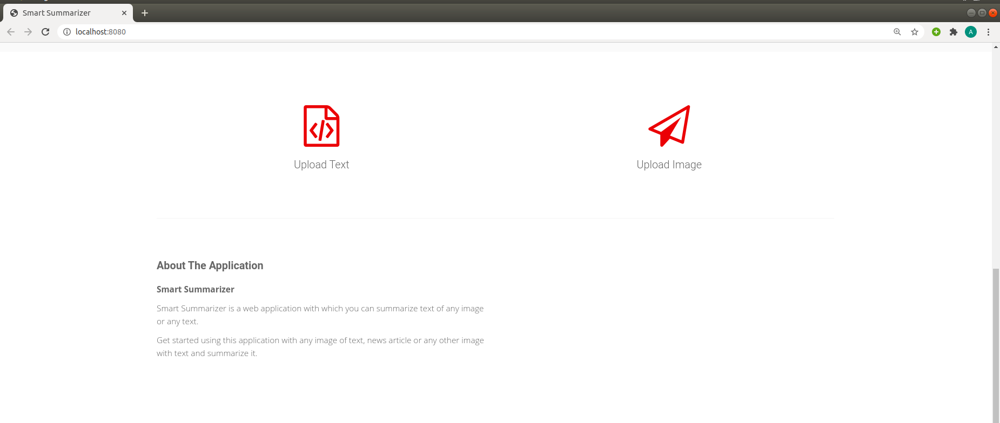
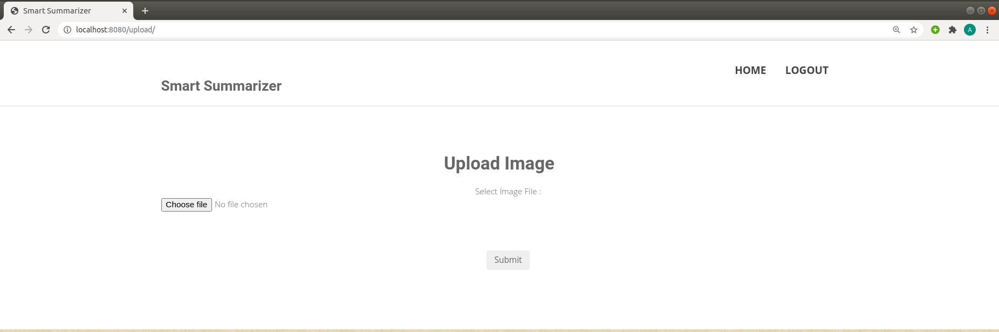
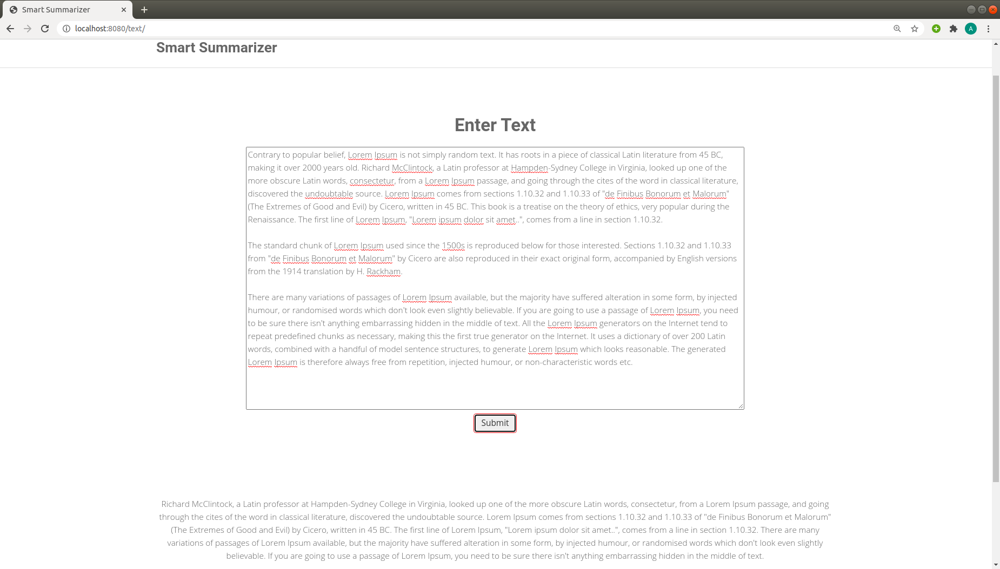

#  Smart Summarizer
   ### Easy to use web application used to summarize text extracted from any picture

    
    This is a web application that can be used to summarize any kind of text easily.
    This can be used to extract text from image and then summarize it or it can be directly used to summarize text.
    Other Features include login and signup on this web application for better personalized experience.

### Application home page 

 
  

     This is the home page of application from where we can navigate to login and signup

  

### Select Option

 
  
 

    This is the page where we can either upload direct text or image with text
     
 

  

### Upload Image or Text Page

 
  
 

    After uploading image with text, the textual content is extracted by using Tesseract.
     
    After this the textual content is summarized to return the summary

 

  

### Summary Page

 
  
 

   
   Here after uploading resource summary is generated
 

  

###     Technologies used: Tesseract (for text extraction), HTML, CSS, JavaScript, jQuery, Node.js.

